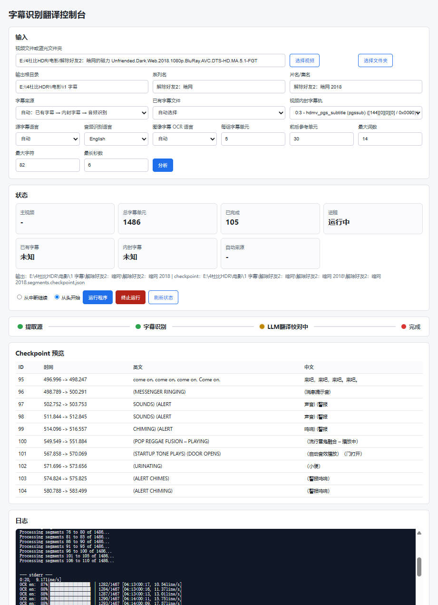

# 双语字幕生成流水线

本项目用于在 Windows 本地生成双语 ASS 字幕，支持普通视频文件、蓝光文件夹、已有字幕文件、MKV/M2TS 内封字幕、PGS 图像字幕 OCR、Whisper 语音识别，以及 Ollama `qwen3:14b` 纠错翻译。

## 界面预览



## 目录结构

```text
.
├─ src/                  # Python 主程序代码
│  ├─ subtitle_frontend.py
│  ├─ audio_to_subtitle.py
│  └─ subtitle_pipeline.py
├─ docs/                 # 项目文档及界面截图
│  └─ images/
├─ scripts/              # 安装和示例运行脚本
├─ runtime/
│  ├─ logs/              # 前端任务日志，可删除
│  └─ scratch/           # 测试输出和临时缓存，可删除
├─ start_frontend.bat    # 双击启动本地前端
├─ requirements-gpu.txt
└─ README.md
```

`runtime/logs/` 和 `runtime/scratch/` 里的运行产物不提交到 Git。没有任务运行时可以清理。

## 前端启动

最简单方式：

```text
双击 start_frontend.bat
```

启动后打开：

```text
http://127.0.0.1:8765
```

手动启动：

```powershell
cd /d "E:\4杜比HDR\电影\字幕抽取识别"
python .\src\subtitle_frontend.py --host 127.0.0.1 --port 8765
```

前端流程：

1. 选择视频文件或蓝光文件夹。
2. 点击“分析”，页面会显示主视频、是否找到已有字幕、是否有内封字幕、内封字幕轨道列表、自动来源判断、checkpoint 和已完成数量。
3. 选择字幕来源：自动、已有字幕文件、视频内封字幕或 Whisper 音频识别。
4. 如果手动选择已有字幕或内封字幕，可以从分析结果中选择具体字幕文件或字幕轨道。
5. 选择源字幕语言、音频识别语言、图像字幕 OCR 语言。
6. 选择“从中断继续”或“从头开始”，点击“运行程序”。
7. 需要中断时点击“终止运行”，前端会终止当前任务进程树。

单个视频文件在“分析”时会优先调用本地 Ollama `qwen3:14b` 识别干净的系列名和片名，例如把发布组、分辨率、编码、音轨、HDR/DV 等标签从文件名中剔除。Ollama 不可用时会退回本地规则识别。

## 字幕来源优先级

默认 `--source auto` 使用以下优先级：

1. 已有字幕文件：优先查找视频同目录或所选文件夹中的 `.srt`、`.ass`、`.ssa`、`.vtt`。
2. 视频内封字幕：读取 MKV/M2TS 等视频内部字幕轨。文本字幕直接抽取；PGS 等图像字幕使用 OCR。
3. 音频识别：前两类都没有时，使用 faster-whisper `large-v3` 从音频生成源语言字幕。

也可以手动指定：

```powershell
--source auto       # 自动：已有字幕 -> 内封字幕 -> 音频识别
--source sidecar    # 只使用已有字幕文件
--source embedded   # 只使用视频内封字幕
--source audio      # 只使用 Whisper 音频识别
```

相关参数：

```powershell
--subtitle-file "E:\path\movie.en.srt"  # 指定已有字幕文件
--subtitle-stream 3                     # 指定内封字幕轨，例如 ffprobe 的 0:3
--source-language en                    # 源字幕语言，auto/en/ja/ko/fr/de/es/zh 等
--asr-language en                       # Whisper 识别语言，auto 表示自动检测
--subtitle-ocr-lang en                  # 图像字幕 OCR 语言，auto/en/ch/chinese_cht/japan/korean 等
```

注意：源字幕和音频不一定是英文。只有英文字幕时，英译中会走和“英文语音识别后再英译中”一致的 5 句分组纠错翻译流程；其他源语言也会先纠错源文，再翻译成简体中文。

## 纠错翻译规则

无论来源是已有字幕、内封字幕 OCR，还是 Whisper 语音识别，都会进入同一套纠错翻译流程：

- 长句、词很多的句子、持续时间太长的句子，会先拆成半句或词组级字幕单元。
- 默认每组处理 `5` 个字幕单元。
- 每组参考前 `30` 个和后 `30` 个字幕单元。
- 上下文只用于理解人物、代词、术语和语义连续性，不会输出到结果。
- 组内先纠正源文，再翻译成自然的简体中文。
- 每个输入字幕单元必须对应一个输出对象。
- 不允许合并、拆分、重排、遗漏或新增字幕单元。

## 时间标签规则

时间标签不交给 LLM 处理。

程序只把字幕文本发给 LLM，不把 `start` / `end` 时间码放进 prompt。LLM 返回后，程序把原始时间码复制回输出字幕，并校验：

- 输出条数必须等于输入条数。
- 每条输出的 `start` 必须等于原始 `start`。
- 每条输出的 `end` 必须等于原始 `end`。
- 如果 checkpoint 与当前字幕切分不匹配，会忽略旧 checkpoint，避免时间轴错配。

Whisper 偶发的“短文本异常长时间”会再经过兜底切分，避免一两个词挂十几秒。

## Checkpoint

翻译过程会写 checkpoint：

```text
<输出目录>\<片名>.segments.checkpoint.json
```

源字幕切分会写：

```text
<输出目录>\<片名>.segments.source.json
```

重新运行同一任务时会先校验 checkpoint 是否和当前字幕切分一致。一致才继续，不一致会忽略旧 checkpoint。

## 示例 1：Ready Player One MKV

```powershell
$root = Split-Path (Get-Location) -Parent
$outRoot = Get-ChildItem -LiteralPath $root -Directory | Where-Object { $_.Name -like '1 *' } | Select-Object -First 1
$video = Join-Path $root 'Ready.Player.One.2018.Eng.Fre.Ger.Ita.Por.Spa.Cze.Hun.Pol.Rus.Tha.Tur.Jpn.2160p.BluRay.Remux.DV.HDR.HEVC.Atmos-SGF.mkv'

python .\src\audio_to_subtitle.py `
  --video "$video" `
  --source auto `
  --output-root "$($outRoot.FullName)" `
  --series-name "Ready Player One" `
  --movie-name "Ready Player One 2018" `
  --llm-model qwen3:14b `
  --batch-size 5 `
  --context-lines 30
```

## 示例 2：头脑特工队2 蓝光文件夹

```powershell
$root = Split-Path (Get-Location) -Parent
$outRoot = Get-ChildItem -LiteralPath $root -Directory | Where-Object { $_.Name -like '1 *' } | Select-Object -First 1
$folder = Join-Path $root '头脑特工队2 [国粤英多音轨+特效中文字幕].2024.USA.BluRay.Remux.UHD.HDR10.2160p.Atmos.TrueHD7.1-DreamHD'

python .\src\audio_to_subtitle.py `
  --video "$folder" `
  --source auto `
  --output-root "$($outRoot.FullName)" `
  --series-name "Inside Out 2" `
  --movie-name "Inside Out 2 2024" `
  --llm-model qwen3:14b `
  --batch-size 5 `
  --context-lines 30
```

也可以直接在前端选择这个文件夹，先点击“分析”，再从页面中选择字幕来源、字幕轨道和语言。

## 输出

默认输出到：

```text
E:\4杜比HDR\电影\1 字幕\<系列名>\<片名>\
```

主要输出：

```text
<片名>.en.ass          # 源文字幕层，文件名保留 en 是为了兼容旧流程
<片名>.zh.ass          # 简体中文字幕
<片名>.bilingual.ass   # 双语字幕
```

## 依赖

- Python
- ffmpeg 或 `imageio-ffmpeg`
- `faster-whisper`
- CUDA 可用的 PyTorch / CTranslate2 环境
- PaddleOCR / pgsrip / OpenCC，用于 PGS/OCR 路径
- Ollama
- Ollama 模型：`qwen3:14b`

安装辅助脚本在 `scripts/` 目录中。

## 质量检查

生成后建议检查：

- ASS 事件数量是否合理。
- 是否存在异常长字幕段。
- 是否存在异常大空档。
- 源文和中文是否一一对应。
- 时间轴是否整体同步。

脚本会打印基础时间统计，例如最大单条时长、超过 6 秒或 8 秒的数量、超过 5 秒的空档数量。
