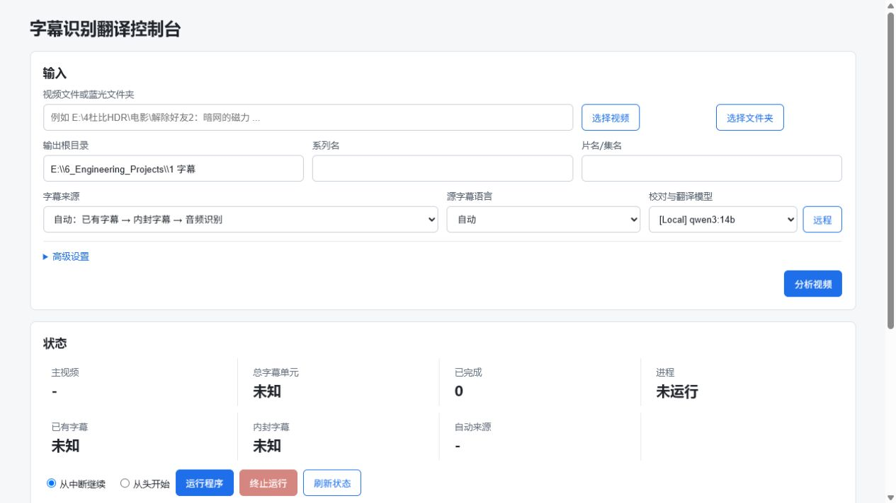
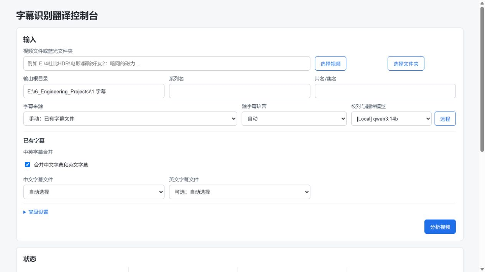

# 双语字幕生成流水线

本项目用于在 Windows 生成专业中英双语 ASS/SRT 字幕，支持普通视频文件、蓝光文件夹、已有字幕文件、MKV/M2TS 内封字幕、PGS 图像字幕 OCR、Whisper 语音识别，以及本地或 SSH 远程 Ollama Qwen 纠错、翻译和独立终审。

## 界面预览





## 目录结构

```text
.
├─ src/                  # Python 主程序代码
│  ├─ subtitle_frontend.py
│  ├─ audio_to_subtitle.py
│  ├─ subtitle_sync.py
│  ├─ scene_timing.py
│  ├─ subtitle_delivery.py
│  ├─ subtitle_quality.py
│  ├─ subtitle_sources.py
│  ├─ font_delivery.py
│  ├─ frontend_settings.py
│  ├─ llm_policy.py
│  ├─ remote_ollama_bridge.py    # 独立 SSH/Ollama 自动重连桥接
│  ├─ subtitle_queue.py          # 持久化系列队列
│  ├─ subtitle_queue_worker.py   # 独立队列 worker
│  ├─ review_evidence.py         # 视听复核证据生成
│  └─ subtitle_pipeline.py       # OCR/轨道工具及兼容入口
├─ docs/                 # 项目文档及界面截图
│  └─ images/
├─ scripts/              # 安装和示例运行脚本
├─ runtime/
│  ├─ logs/              # 前端任务日志，可删除
│  ├─ queue/             # 持久化队列状态和 worker 日志
│  ├─ remote-bridge/     # 独立远程桥接状态和日志
│  └─ scratch/           # 测试输出和临时缓存，可删除
├─ start_frontend.bat    # 双击启动本地前端
├─ requirements.txt      # 锁定的基础依赖
├─ requirements-gpu.txt
├─ requirements-ci.txt
├─ pyproject.toml
└─ README.md
```

`runtime/logs/` 和 `runtime/scratch/` 里的运行产物不提交到 Git。没有任务运行时可以清理。

## 前端启动

最简单方式：

```text
双击 start_frontend.bat
```

启动后打开：

```text
http://127.0.0.1:8765
```

启动器会先检查 `/api/health` 和当前源码指纹，优先复用真正运行最新版代码的实例。若端口已被其他程序或旧前端占用，会在 `8765` 到 `8799` 中选择第一个空闲端口，避免打开另一个项目或过期页面。

手动启动：

```powershell
cd /d "E:\6_Engineering_Projects\bilingual-subtitle-pipeline"
python .\src\subtitle_frontend.py --host 127.0.0.1 --port 8765
```

前端流程：

1. 选择视频文件或蓝光文件夹。
2. 选择字幕来源：自动、已有字幕文件、视频内封字幕或 Whisper 音频识别。
3. 页面只展开当前来源需要的选项；中英双轨选择、OCR 和音频识别设置不会同时平铺。
4. 点击“分析视频”，页面会显示主视频、已有/内封字幕、自动来源判断、checkpoint 和已完成数量；自动模式随后展开命中的来源选项。
5. 按需选择具体字幕文件、字幕轨道和语言。使用已有字幕且开启时间同步时，页面会继续显示“用于字幕同步的音轨”；批量、上下文与显示长度限制在“高级设置”中。
6. 先检查“运行前确认”中的字幕来源、模型位置、复核策略和输出位置。远程模型断开时运行会保持锁定，不会静默改用本地 GPU；来源设置变化后必须重新分析。
7. 有 checkpoint 时选择运行方式，再点击“运行程序”；新任务不会显示无关的恢复选项：
   - `继续任务`：复用 source cache 和 checkpoint，只处理未完成部分。
   - `重新校对（保留识别）`：保留音频识别、OCR 和内封字幕缓存，删除旧 checkpoint 与 ASS，用当前提示词重新校对翻译。
   - `完全重建`：删除本任务的识别缓存、checkpoint 和 ASS，从字幕源提取阶段重新开始。
8. 需要中断时点击“终止运行”，前端会终止当前任务进程树。
9. 成片生成后，“成片复核”会按时间轴、识别置信度、同步、术语、终审和渲染问题筛选具体事件；“复核”会打开同一时间段的视频帧、上下文音频、波形、前后字幕和编辑区。保存后再运行“继续任务”重新生成。人工时间调整会保存来源锚点，断点恢复和独立终审不会丢失或覆盖已确认内容。
10. 长片可在“高级设置”启用“夜间无人值守复核（2 轮）”。它使用当前所选模型执行语义完整性和专业可读性两轮独立复核，逐轮保存断点，并在失败时保留上一轮有效结果及审计证据。推荐配合远程 `qwen3.5:122b` 使用。
11. 系列剧集可点击“扫描同目录剧集”，选择条目加入“系列批量队列”。确认来源、模型、复核与外观策略后点击“开始队列”；关闭网页不会停止独立 worker。队列逐集重新分析实际字幕/音频资产并从各自 checkpoint 恢复，不会把上一集的外置字幕路径直接带到下一集。

单个视频文件在“分析”时会优先调用本地 Ollama `qwen3:14b` 识别干净的系列名和片名，例如把发布组、分辨率、编码、音轨、HDR/DV 等标签从文件名中剔除。Ollama 不可用时会退回本地规则识别。

## 远程 Ollama 与 SSH 密钥

前端“校对与翻译模型”右侧的“连接”按钮支持两种 SSH 认证：

- `SSH 密钥`：默认方式。主机可填写 IP 或 `~/.ssh/config` 中的别名；密钥文件留空时自动读取 SSH config、SSH agent 和默认密钥。
- `密码`：兼容旧服务器。只有选择密码认证后才显示密码和“使用 Windows 凭据保护保存密码”。

当前机器的推荐配置为：

```text
服务器：10.12.96.203（也可填写 ai-server）
端口：22
用户名：csynth
认证方式：SSH 密钥
密钥文件：留空，读取 ~/.ssh/config
```

后端会解析 OpenSSH 的 `HostName`、`User`、`IdentityFile`、`IdentitiesOnly` 和 keepalive 设置，并使用 `known_hosts` 校验服务器身份。验证连接后会启动独立于网页的本机 Ollama 桥接进程，在 `127.0.0.1:11436..11455` 选择固定代理端口，并用随机内部转发端口连接远端 `127.0.0.1:11434`。翻译子进程和批量 worker 只访问这个本机代理；网页退出不会销毁隧道，网络切换或 SSH/Ollama 健康检查失败后会按 1 到 30 秒退避自动重连。选择 `remote:<连接名>:<模型>` 时不会调用本地 Ollama；模型默认在最后一次请求后保留 10 分钟，可通过 `OLLAMA_KEEP_ALIVE` 调整。

翻译调用使用 Ollama 原生 `/api/chat`，不是兼容层 `/v1/chat/completions`。元数据识别、翻译和已有双语校对使用不同的固定生成参数；翻译/校对响应由 JSON Schema 限定对象数量、索引、字段类型和术语结构，再经过程序语义校验。使用 `qwen3:30b` 时显式关闭思考，避免推理文本耗尽字幕 JSON 的输出预算。

表单和非敏感远程配置由本地前端统一保存在 `%LOCALAPPDATA%\BilingualSubtitlePipeline\frontend-settings.json`，因此切换前端端口后仍会恢复。密钥模式只保存可选的密钥路径，不读取或复制私钥内容。密码模式勾选保存后使用当前 Windows 用户的 DPAPI 加密，配置文件和浏览器 `localStorage` 都不保存明文密码；其他 Windows 用户不能解密。密钥认证或已用 DPAPI 保存的密码才能在网页关闭后自动重连；密码模式不勾选保存时，当前网页连接仍可用，但界面会明确提示它不能持久恢复。保存接口只允许 loopback Host，请求体必须是 `application/json` 且不超过 1 MiB；前端也拒绝绑定到非本机地址。

## 系列持久化批量队列

队列状态保存在 `runtime/queue/subtitle-queue.json`，由跨进程文件锁保护并原子替换。队列只串行领取一集，避免多个长片同时争用 GPU、远程模型和输出目录。支持暂停领取、上下移动、取消、失败后重试、移除以及加载已完成剧集进入成片复核。

独立 `subtitle_queue_worker.py` 会记录 PID、心跳、活动条目和每集实际处理 PID。网页或 worker 异常退出后，下一次 worker 会先读取任务输出目录中的 run-state：旧处理进程仍存活就接管监控；进程已结束则读取日志、checkpoint 和质量报告确定成功/失败；只有在分析阶段尚未启动处理进程时才安全重新排队。暂停队列不会终止当前集，只阻止领取下一集。

每个队列条目保存加入时的来源策略、模型、复核轮数和字幕外观设置，但会逐集重新扫描 sidecar、内封字幕和音轨，并按处理计划填写该集实际的中英文资产。外置字幕绝对路径不会跨集复用；显式 stream index 只有在该集分析中仍能匹配时才进入计划。远程队列要求 SSH 密钥或已保存密码，以便前端关闭后继续恢复连接。

## 视听复核工作台

“成片复核”的每个可定位事件都可按需生成证据，不会预先为整片抽取大量媒体：

- 目标字幕中点的视频帧；
- 目标前后最多 4 秒、最长 14 秒的单声道上下文音频；
- 该音频的真实波形；
- 当前事件前后各两条 checkpoint 字幕。

证据缓存在任务输出目录的 `.review-evidence/<缓存键>/`。缓存键包含视频路径、大小、修改时间、字幕时间和音轨；视频或时间修改后会生成新证据。网页只返回随机临时媒体令牌，并支持音频 Range 请求，不提供任意本地路径读取接口。工作台用于判断对白结束点、相邻语义和明显画面遮挡；单帧与短音频仍不能替代逐镜播放、口型精校和实际手机/HDR 播放器验收。

## 字幕来源优先级

默认 `--source auto` 先扫描全部可用来源，再按来源证据生成确定性处理计划：

1. 人工文本优先于图像 OCR，图像 OCR 优先于音频 ASR。
2. 同等条件下优先内封人工文本；与视频文件名匹配的外置 `.srt/.ass/.ssa/.vtt` 会获得同版本匹配加权，目录中其他影片的字幕不会自动选择。
3. 中文轨优先普通完整对白和简体；繁体会先转简体再校对。英文源轨优先 SDH，以保留普通英文轨没有的音乐、说话者和环境提示。
4. forced 轨只作补充，并且只选择与主源语言匹配的最佳一条；commentary/无障碍解说音轨不参与自动选择。只有这类音轨时不会静默运行 Whisper，必须由用户明确指定音轨。
5. 中文和源语言轨可以来自不同位置，例如内封中文配外置英文 SDH；跨来源轨仍分别同步后再合并。

也可以手动指定：

```powershell
--source auto       # 自动：按来源质量、语言、角色和匹配关系生成处理计划
--source sidecar    # 只使用已有字幕文件
--source embedded   # 只使用视频内封字幕
--source audio      # 只使用 Whisper 音频识别
```

相关参数：

```powershell
--subtitle-file "E:\path\movie.en.srt"  # 指定已有字幕文件
--subtitle-stream 3                     # 指定内封字幕轨，例如 ffprobe 的 0:3
--source-language en                    # 源字幕语言，auto/en/ja/ko/fr/de/es/zh 等
--asr-language source                   # Whisper 识别语言；source 表示跟随 --source-language，auto 表示自动检测
--subtitle-ocr-lang en                  # 图像字幕 OCR 语言，auto/en/ch/chinese_cht/japan/korean 等
--subtitle-sync auto                    # 已有字幕对音频：auto / detect / off
```

注意：源字幕和音频不一定是英文。只有英文字幕时，英译中会走和“英文语音识别后再英译中”一致的 5 句分组纠错翻译流程；其他源语言也会先纠错源文，再翻译成简体中文。

## 来源感知的纠错翻译规则

不同来源共用输出契约和终审，但采用不同的源文编辑权限：

- 人工源字幕只做标记和空白归一化，Qwen 不能改写或隐藏其源文；已有中文先繁转简并保守校对，不重新翻译。
- OCR 只在低置信度或上下文能够证明错误时修复；ASR 可修复低置信片段和有相邻证据的重复幻觉。
- 中文为空时才翻译源语言独有内容，包括英文 SDH、音乐、音效和说话者提示；已有中文不会被补译流程覆盖。
- 长句、词很多的句子、持续时间太长的句子，会先拆成半句或词组级字幕单元。
- 默认每组处理 `5` 个字幕单元。
- 每组参考前 `30` 个和后 `30` 个字幕单元。
- 上下文只用于理解人物、代词、术语和语义连续性，不会输出到结果。
- 后续批次还会看到前面已经确认的源文/中文结果，用于保持人名译法和术语一致。
- 对完整影片先均匀抽样生成片级风格指南，在第一批前固定语气、人名、称谓、SDH 补译和标点策略。
- 每个目标对象会返回本句出现的人名/术语映射；程序维护独立的片级术语表，后续批次即使已超出滑动上下文也必须复用。
- 组内先纠正源文，再翻译成自然的简体中文。
- 每个输入字幕单元必须对应且只能对应一个输出对象；模型缺行、重复索引或返回可见空译文时会中断当前批次，不会把错误结果写入 checkpoint。
- 重复或滚动片段可以保留最早完整项并把后续冗余项设为 `display=false`；程序只在相邻可见字幕能确定性覆盖该源文时接受隐藏请求，无法证明覆盖的唯一字幕会强制保留并复核译文。
- Qwen 会收到按当前可用显示时间计算的中文/源文字符预算；中文过长时优先压缩表达，不丢失原意。
- 模型完成后会再次按默认 12 词、英文每条 42 字符、中文每条 16 字和 5.5 秒的硬上限准备 ASS 显示事件，并执行阅读速度和时间轴检查。中英文分别断句，并优先在句号、问号、逗号等自然边界切分；实际字体、字号、画幅和 ASS 安全边距也会参与最终拆句。
- 首轮完成后由独立终审批次检查残留识别错误、错译、人名、称谓、术语和 SDH；无效终审结果不会覆盖首轮字幕，而会进入人工复核。兼容字段 `corrected_english` 实际代表源语言轨，日语、韩语等源文不会在终审中被改写成英文。
- 可选夜间自治复核在独立终审后再执行最多三种不同侧重点的审查。网页固定为两轮以减少选项；命令行通过 `--autonomous-review-rounds 0..3` 控制。每轮写入独立断点，人工确认行始终只读，最终仍由排版、同步、渲染和质量报告工具决定是否需要复核。

## 时间标签规则

时间标签不交给 LLM 处理。

程序会把时间码作为上下文参考，但不允许 LLM 返回或修改时间。LLM 返回后先校验模型输出仍使用源字幕时间锚：

- 输出条数必须等于输入条数。
- 每条输出的 `start` 必须等于原始 `start`。
- 每条输出的 `end` 必须等于原始 `end`。
- 如果 checkpoint 与当前字幕切分不匹配，会忽略旧 checkpoint，避免时间轴错配。

生成最终显示事件时再执行确定性时间整理：

- Whisper 滚动窗口发生重叠时，先按识别顺序消解重叠，再切分长句，避免两句话的碎片交错显示。
- 已有字幕中内容不同的同时对白、对白与画面文字重叠会保留为并行 ASS 事件；只有重复/滚动识别片段才裁剪或隐藏。
- 重叠裁剪后不足 0.4 秒的闪烁残片会丢弃；相邻字幕尽量保留约 2 帧间隔。
- Whisper 偶发的“短文本异常长时间”会再经过兜底切分，避免一两个词挂十几秒。
- 中文目标为每秒不超过 9 个非空白字符、双语事件中中文单行不超过 16 字；英文目标为每秒不超过 20 个字符、英文单行不超过 42 字。双语 ASS 固定为“中文一行 + 源文一行”，不会把两行额度重复分配给同一种语言。
- 阅读时间不足且下一条字幕前有安全空档时，出点最多延长 0.5 秒；绝不越过下一条字幕。
- 双语再次拆分时优先使用 Whisper 词级时间戳；已有字幕没有词锚点时不会凭空均分成延迟出现的后半句。
- 画面以低分辨率 6 FPS 检测并缓存镜头切点，字幕边缘只在 0.25 秒安全窗口内吸附，且不能截断词锚点或越过相邻字幕。
- 程序会打印中文、英文和东亚源文的最大 CPS、超目标事件数及超单行目标事件数，便于对整片做量化复核。

已有中英文字幕合并时，先让中文轨和英文轨分别用 `ffsubsync 0.5.1` 对齐到同一条所选音频，再进行中英事件配对；只有两条轨都通过质量门槛才整体采用，任一轨失败就同时回退原时间，避免只移动一条轨破坏双语对应。自动选择的同步音轨会写入处理计划和来源指纹；如果只发现 commentary/无障碍解说音轨，则保留已有字幕时间并要求用户明确选轨，不会用错误音频静默同步。没有重叠且间隔超过 0.75 秒的中英文事件不会强行配对。程序用稳定事件标记恢复原顺序，并检查搜索边界、乱序、分段跳变和时长变化；不安全的分段候选会自动降级到全局对齐，两者都不合格时保持原时间。逐轨结果写入 `<片名>.subtitle-sync.report.json` 的 `tracks` 字段。`detect` 只报告候选偏移，`off` 完全跳过；音频 ASR 来源不执行这一步，也不会因此占用本地 GPU。

阅读速度与行宽参考 [Netflix 简体中文规范](https://partnerhelp.netflixstudios.com/hc/en-us/articles/215986007-Chinese-Simplified-Timed-Text-Style-Guide)、[Netflix 英文规范](https://partnerhelp.netflixstudios.com/hc/en-us/articles/217350977-English-USA-Timed-Text-Style-Guide)、[Netflix 时间规范](https://partnerhelp.netflixstudios.com/hc/en-us/articles/360051554394-Timed-Text-Style-Guide-Subtitle-Timing-Guidelines) 和 [Prime Video 字幕规范](https://videocentral.amazon.com/support/delivery-specifications/prime-video-subtitling-guidelines?language=en_US)。项目采用较保守的中文 9 CPS、英文 20 CPS 作为诊断目标；这不是承诺每条旧来源字幕都能在不删减原意的前提下自动达标。

## 字幕外观与手机适配

前端的“字幕外观”默认折叠，提供三种显示方案：

- `自适应画面`：默认方案，适合电视、显示器和一般手机横屏播放。
- `手机大字`：在相同画面比例下增大中英文字号、描边和底部安全边距。
- `紧凑`：减小字幕占用，适合小画面里需要保留更多影像内容的场景。

程序不再把所有 ASS 固定为 `1920×1080`。生成字幕前会用 `ffprobe` 读取视频宽高、像素宽高比、显示宽高比和旋转信息，再计算与真实画面一致的 ASS `PlayResX/PlayResY`。例如 `640×352`、显示宽高比 `20:11` 的视频会使用 `1964×1080`，所以字号和安全边距按画面高度等比例缩放，不会因为源文件分辨率较低而变得异常小。选择字体文件时使用其真实 glyph advance 测量每行像素宽度；未选择字体文件时使用保守的 Unicode 字宽估计。超过当前 ASS 安全宽度的双语事件会增加分段，而不是依赖播放器临时折行。

命令行参数：

```powershell
--subtitle-style-profile adaptive   # adaptive / mobile / compact
--subtitle-font-name "Arial"        # ASS 字体族名，不是字体文件名
--subtitle-font-scale 100           # 70 到 160
--subtitle-font-file "E:\Fonts\MyFont.ttf"
```

字体文件本身只决定字形和字符覆盖，不负责适配屏幕。选择 TTF/OTF/TTC 后，程序用 `fonttools` 读取字体内部 family name，复制字体到输出目录的 `fonts/`，并用 ffmpeg 生成包含双语 ASS 和字体附件的 `<片名>.bilingual.mks`；不需要复制整部电影。支持 Matroska 字幕附件和 libass 内嵌字体的播放器可直接加载该小型字幕包。外置 `.ass` 仍可单独使用，但播放器找不到字体时会回退。

ASS 的自适应基于视频画面比例，无法在生成时获知手机的物理尺寸、刘海/系统控件、当前横竖屏状态或系统无障碍字幕字号。播放器还可能覆盖或忽略 ASS 样式。因此：

- 手机横屏优先选择“手机大字”，并在目标播放器里实际预览。
- 需要系统级字号跟随时，优先使用同时生成的 `.srt`，由播放器选择系统字体和无障碍字号；任意 ASS 文件不能保证跟随 iOS/Android 设置。
- 播放器应保留 ASS 样式并启用内嵌字体。强制覆盖字幕字体、字号或样式会改变生成结果。
- 同一字幕需要同时覆盖电视和手机且阅读距离差异较大时，生成两份不同显示方案通常比依赖播放器猜测更可靠。

每次还会用 ffmpeg/libass 在第一条可见字幕的真实时间渲染 `<片名>.render-preview.png`，并把像素检查结果写入 `<片名>.render-validation.json`。这能发现 ASS 语法、滤镜或字体加载导致的“文件存在但字幕没画出来”，不能替代目标手机播放器实测。

## Checkpoint

翻译过程会写 checkpoint：

```text
<输出目录>\<片名>.segments.checkpoint.json
```

源字幕切分会写：

```text
<输出目录>\<片名>.segments.source.json
<输出目录>\<片名>.source-manifest.json
<输出目录>\<片名>.processing-plan.json
```

`source-manifest` 记录每条实际来源的类型、语言、文字系统、角色、权威和文件/轨道；`processing-plan` 记录中英轨、补充轨、时间基准、处理步骤及本地/远程计算位置。`execution.source_cache_reused=true` 时，本次不会重新 OCR/ASR，`execution.local_gpu` 为空。

重新运行同一任务时会先校验 checkpoint 是否和当前字幕切分、来源请求及处理计划一致。一致才继续，不一致会忽略旧 checkpoint。

校验还包含 `llm_model` 和 `processing_policy_version`。模型或提示词/阅读策略升级后，网页会明确提示 checkpoint 需要重新校对，并默认选择“重新校对（保留识别）”，不会删除 source cache。片级术语表写入：

```text
<输出目录>\<片名>.terminology.json
```

完整影片还会写入可恢复的整片分析：

```text
<输出目录>\<片名>.style-guide.json
<输出目录>\<片名>.final-qa.json
<输出目录>\<片名>.scene-cuts.json
```

前端三个运行方式的缓存边界：

| 运行方式 | source cache / OCR | checkpoint | 已生成字幕 |
| --- | --- | --- | --- |
| 继续任务 | 复用 | 复用 | 完成后覆盖 |
| 重新校对（保留识别） | 复用 | 删除并重做 | 删除并重做 |
| 完全重建 | 删除并重建 | 删除并重做 | 删除并重做 |

旧的纯 ASR/单语 source cache 继续直接复用。旧的双语合并 source cache 因缺少新版时间锚元数据会重建一次；sidecar 只重新解析字幕文件。新版 embedded/OCR 缓存会按视频、轨道、渲染配置和图片哈希复用；OCR v3 保存置信度并兼容续跑 v2，旧的无指纹 OCR 缓存会重建一次。

新版 source cache 带有来源请求指纹，覆盖视频、字幕文件及修改时间、字幕/音频轨、识别语言和 OCR 配置。更换字幕文件或轨道后不会继续使用上一轮缓存。旧纯 ASR 缓存和 checkpoint 会在一次成功续跑后原位升级，不需要重新抽取音频。

如果字幕切分规则升级，旧纯 ASR source cache 仍会直接复用，因此不会重新抽取音频或运行 Whisper；但旧 checkpoint 的分段契约可能不再匹配，需要用现有 source cache 重新执行一次校对翻译。

音频抽取的临时 WAV 写在当前字幕输出目录，使用 `.subtitle-audio.<PID>.wav` 专用名称；程序不会创建、覆盖或删除视频旁边的同名 WAV。

前端启动的任务还会写入隐藏的 `.subtitle-run.json` 状态文件。前端意外关闭或重启后可以重新发现原进程，避免重复启动，并仍可通过网页安全终止该任务。

前端状态会区分运行中、完成、失败、中断和用户终止。失败时显示最后阶段和错误摘要；只有实际存在 checkpoint 时才提示从中断继续。

## 示例 1：Ready Player One MKV

```powershell
$root = Split-Path (Get-Location) -Parent
$outRoot = Get-ChildItem -LiteralPath $root -Directory | Where-Object { $_.Name -like '1 *' } | Select-Object -First 1
$video = Join-Path $root 'Ready.Player.One.2018.Eng.Fre.Ger.Ita.Por.Spa.Cze.Hun.Pol.Rus.Tha.Tur.Jpn.2160p.BluRay.Remux.DV.HDR.HEVC.Atmos-SGF.mkv'

python .\src\audio_to_subtitle.py `
  --video "$video" `
  --source auto `
  --output-root "$($outRoot.FullName)" `
  --series-name "Ready Player One" `
  --movie-name "Ready Player One 2018" `
  --llm-model qwen3:14b `
  --batch-size 5 `
  --context-lines 30
```

## 示例 2：头脑特工队2 蓝光文件夹

```powershell
$root = Split-Path (Get-Location) -Parent
$outRoot = Get-ChildItem -LiteralPath $root -Directory | Where-Object { $_.Name -like '1 *' } | Select-Object -First 1
$folder = Join-Path $root '头脑特工队2 [国粤英多音轨+特效中文字幕].2024.USA.BluRay.Remux.UHD.HDR10.2160p.Atmos.TrueHD7.1-DreamHD'

python .\src\audio_to_subtitle.py `
  --video "$folder" `
  --source auto `
  --output-root "$($outRoot.FullName)" `
  --series-name "Inside Out 2" `
  --movie-name "Inside Out 2 2024" `
  --llm-model qwen3:14b `
  --batch-size 5 `
  --context-lines 30
```

也可以直接在前端选择这个文件夹，先点击“分析”，再从页面中选择字幕来源、字幕轨道和语言。

## 输出

不指定 `--output-root` 时，程序按以下顺序选择输出根目录：

1. 查找视频附近已有的 source cache、checkpoint 或双语 ASS，并继续使用其输出根目录。
2. 查找视频上级目录附近已有的 `1 字幕` 目录。
3. 都不存在时，建议使用 `<视频所在目录>\1 字幕`。

前端的“输出根目录”可以留空使用上述自动查找，也可以手动指定；环境变量 `SUBTITLE_OUTPUT_ROOT` 可配置固定默认目录。最终目录结构仍为 `<输出根目录>\<系列名>\<片名>\`。

主要输出：

```text
<片名>.en.ass          # 源文字幕层，文件名保留 en 是为了兼容旧流程
<片名>.zh.ass          # 简体中文字幕
<片名>.bilingual.ass   # 双语字幕
<片名>.en.srt          # 手机/原生播放器兼容源文字幕
<片名>.zh.srt          # 手机/原生播放器兼容中文字幕
<片名>.bilingual.srt   # 中文在上、源文在下
<片名>.bilingual.mks   # 选择字体文件时生成，包含 ASS 与字体附件
<片名>.subtitle-sync.report.json
<片名>.terminology.json
<片名>.style-guide.json
<片名>.final-qa.json
<片名>.scene-cuts.json
<片名>.render-validation.json
<片名>.render-preview.png
<片名>.quality-report.json
```

## 依赖

- Python
- ffmpeg 或 `imageio-ffmpeg`
- `faster-whisper`
- `ffsubsync==0.5.1`，用于已有字幕的音频对齐
- `fonttools`，用于读取并交付自定义字体
- `psutil`，用于前端重启后验证并恢复运行任务
- CUDA 可用的 PyTorch / CTranslate2 环境
- PaddleOCR / OpenCC，用于 PGS/OCR 路径；PGS 默认使用仓库内解析器，已安装的 `pgsrip` 仅作为可选兼容后端
- Ollama
- Ollama 模型：本地默认 `qwen3:14b`；推荐远程 `qwen3:30b` 做整片风格、翻译和终审

基础依赖、GPU/OCR 依赖和 CI 依赖分别锁定在 `requirements.txt`、`requirements-gpu.txt` 和 `requirements-ci.txt`。安装辅助脚本在 `scripts/` 目录中。GitHub Actions 在 Windows/Python 3.13 上执行 Ruff、编译检查和全部单元测试。

`src/audio_to_subtitle.py` 是唯一正式处理入口。旧的 `src/subtitle_pipeline.py` 仍提供轨道探测、PGS/OCR 和配对函数；直接执行时会把兼容参数转发到正式入口，不再运行另一套翻译与缓存流程。

## 质量检查

每次成功生成都会原子写入 `<片名>.quality-report.json`，前端“成片质检”直接显示 `通过 / 建议复核 / 未通过`。报告包含：

- 按实际 ASS 样式计算的中英文像素宽度和超限样本。
- 中文 9 CPS、英文 20 CPS、最长显示时间、非正时长和意外重叠。
- 可见空字幕、缺少中文、中文轨仍是外文、英文来源轨意外混入东亚文字、术语映射冲突；合法日语/韩语源轨按源文处理，不会当成英文污染。
- 字幕同步结果、疑似 forced/signs 稀疏轨、短于约 20 帧的事件，以及 Whisper/OCR 低置信度样本。
- 模型隐藏请求中被程序强制恢复的唯一字幕，以及被确认覆盖后接受隐藏的数量。
- 整片风格分析、独立终审、真实 ASS 渲染状态，以及 ASS/SRT/字体字幕包等交付文件路径。

合法同时对白单独记为 intentional overlap，不会被误判为失败。结构性错误会把任务标记为失败；阅读速度、识别置信度、同步关闭或模型保护等可人工判断的问题标记为“建议复核”，字幕文件仍保留。前端可筛选报告样本并编辑对应 checkpoint。

## 更新日志

* `0.5.0`：新增来源资产清单和处理计划；按人工文本/OCR/ASR分别保护或修复；支持内封/外置跨来源中英合并、英文 SDH/forced 缺失内容补译、运行期 GPU/cache 可见性及前端层级来源方案。
* `0.4.0`：新增片级风格预分析、可恢复独立终审、ASR/OCR 置信度、镜头切点吸附、可编辑成片复核、英文/中文/双语 SRT 和真实 libass 渲染验证。
* 已有字幕默认使用 ffsubsync 做低质量保护的全局/分段音频同步，并生成可审计报告；音频 ASR 来源不重复同步。
* 新增模型隐藏保护：只有已被较早相邻可见字幕覆盖的重复/片段才允许隐藏，唯一字幕会恢复显示并在必要时重新请求完整中文。
* 新增真实字体/Unicode 像素宽度约束和成片级 `quality-report.json`，前端直接显示质检状态与报告路径。
* 来源字幕的合法同时对白会保留为 ASS 并行事件，ASR/OCR 重复片段仍按原规则去重。
* 新增片级术语表、模型标识和处理策略版本，解决远距离人物名漂移及旧 checkpoint 静默复用。
* 自定义字体可读取内部 family name，并输出带字体附件的 `.bilingual.mks` 小型字幕包。
* 统一正式 CLI 入口，锁定依赖并增加 Windows CI；网页设置跨端口持久化，密码改用 Windows DPAPI。
* 新增按可用显示时间计算的 Qwen 字符预算、中文 9 CPS/英文 20 CPS 诊断、16/42 字行宽目标和最多 0.5 秒的安全出点延长。
* 最终输出在切分前后消解时间轴重叠，修复 ASR 滚动窗口导致的字幕碎片交错、叠字和极短闪烁残片。
* 前端运行方式拆为“继续任务”“重新校对（保留识别）”“完全重建”，修改提示词后可直接复用 ASR/OCR 结果。
* ASS 字幕改为按真实显示宽高比和旋转信息生成虚拟分辨率，统一新旧生成器的中英文字号、描边与安全边距；前端新增折叠的“字幕外观”，支持自适应、手机大字、紧凑、字体族和字号比例。
* 修复项目迁移后默认输出根目录失效的问题：前端和命令行会从视频附近自动恢复已有任务，旧浏览器中保存的项目相对默认值也会迁移清除。
* 修复带词级时间戳的断句在加入下一个词后才检查限制的问题，并在最终输出再次执行时长兜底。
* 增加最终确定性重复过滤：模型漏掉的短时间内长文本完全重复会隐藏，短对白和间隔较远的真实重复仍保留。
* OCR/字幕抽取缓存增加输入和配置指纹，并支持从部分 OCR 进度继续；旧无指纹缓存会安全重建一次。
* 中英文事件合并支持一对多和多对一断句，同时避免正常相邻字幕因轻微轨道偏移被连锁合并。
* 前端新增稳定的失败、中断和用户终止状态，显示最后失败阶段与错误摘要，并按真实 checkpoint 存在性给出恢复提示。
* 完善了 LLM 输出契约和语言校验：批次缺行、重复索引、可见空译文或中文轨仍是外文时会重试；连续失败则中断并保留最近 checkpoint，不再用原外文污染中文字幕。
* 修复了前端控制台在最后“生成合并双语字幕”阶段没有状态更新的问题，现在会正确显示“合并中英文字幕中”。
* 修复了合并已有中英文字幕时，若英文行缺失（如中文单方面翻译了屏幕 UI 文本），ASS 字幕文件中对应位置会强行打出字面量 `-` 的问题。现在会保持干净空白。
* 翻译提示词中新增了自动翻译括号或方括号内大写场景提示音（如 `(SIGHS)`、`[MUSIC]`）的规则。
* 增强了 LLM 翻译过程中的网络容错与中断恢复机制：遇到网络或大模型服务连接异常时会自动重试 3 次，若依然失败则主动抛出错误中断翻译，保留最近的 checkpoint，用户排除网络故障后重新运行即可无缝断点续传。
